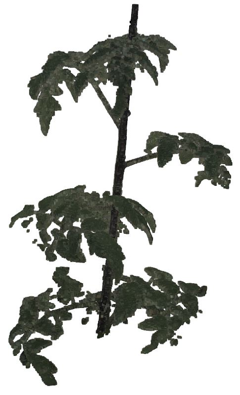
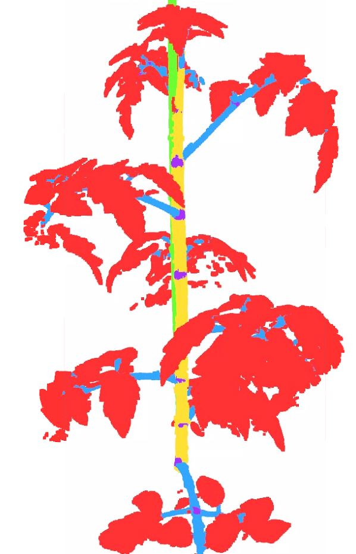
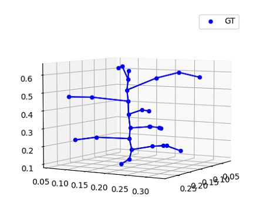

# 3D tomato dataset

<!-- Data and code that this test set is based upon can be found at [LAST-Straw](https://lcas.github.io/LAST-Straw/) -->

IMPROTANT: The dataset is not yet published, and is currently being used for a paper. It is therefore, not possible to use this dataset for any publication without permission of Bart van Marrewijk and Gert Kootstra (bart.vanmarrewijk@wur.nl & gert.kootstra@wur.nl)

This repo contains two items. 
1. A basic data class that can be used to visualize the 3D tomato dataset. The class is based upon Pytorch's Dataset class and can therefore be used within Pytorch's dataloader used for training models for machine learning-> run python wurTomato.py/
The visualisation uses [Open3D](https://www.open3d.org/) 
2. An example to use the dataset to apply semantic segmentation using the pointcept git. Subsequently, convert the semantic algorithm to nodes/skeleton, and evaluate the algorithm accordingly. Using semantic segmentation to convert nodes to a skeleton is one of the solutions. Besides this benchline method, we encourage you to think out of the box and for example use skeleton based approach. A starting point can be the use of graph neural networks [example](https://github.com/suprosanna/relationformer)

<center>
    <p align="center">
        
        
        
    </p>
</center>

## Installation (without pointcept)

```
conda create -n summerschool python=3.8 -y
conda activate summerschool
pip install open3d
pip install pandas
pip install natsort
```

## Download and view dataset
This will download the dataset. If everything is correct a folder 3DTomatoDataset will be created.
If not, then download the dataset by hand using following [link](https://filesender.surf.nl/?s=download&token=a5b7382f-28f5-4619-887e-8ed26db65051]). Create a folder named 3DTomatoDataset, and unzip results overhere.

```
python wurTomato.py --visualise 0
# should result in following dataset structure
#3DTomatoDatasets
#└── 20240607_summerschool_csv
#    ├── annotations
#    ├── images
#    ├── test.json
#    ├── train.json
#    └── val.json
```
Also other properties can be visualized like the semantic segmentatoin, skeleton, or example of inference output
```
python wurTomato.py --visualise_semantic 0
python wurTomato.py --visualise_skeleton 0
python wurTomato.py --visualise_inference Resources/Harvest_01_PotNr_179.txt
```


## Installation (including pointcept library)
```
conda install ninja -y
# Choose version you want here: https://pytorch.org/get-started/previous-versions/
conda install pytorch==1.12.1 torchvision==0.13.1 torchaudio==0.12.1 cudatoolkit=11.3 -c pytorch -y
conda install h5py pyyaml -c anaconda -y
conda install sharedarray tensorboard tensorboardx yapf addict einops scipy plyfile termcolor timm -c conda-forge -y
conda install pytorch-cluster pytorch-scatter pytorch-sparse -c pyg -y
pip install torch-geometric
pip install spconv-cu113
```

FNow the fun part starts, to install the library. If you do not use docker, first check gpu achitecture at
https://developer.nvidia.com/cuda-gpus 


```
# PTv1 & PTv2 or precise eval
cd Pointcept/libs/pointops
# usual
python setup.py install
# docker & multi GPU arch
#TORCH_CUDA_ARCH_LIST="ARCH LIST" python  setup.py install
# e.g. 7.5: RTX 3000; 8.0: a100 More available in: https://developer.nvidia.com/cuda-gpus
TORCH_CUDA_ARCH_LIST="8.6" python  setup.py install
cd ../..
```

For ptv3 you need to isntall flash attention:

```
pip install packaging
pip install flash-attn --no-build-isolation


```


## Training a semantic segmentation model:
Training a semantic segmenation algortihm is done using the json in the dataset folder. See example below.

```
python Pointcept/tools/train.py --config-file example_configs/semseg-pt-v3m1-0-base.py --num-gpus 1 --options save_path=./work_dir/debug/
```

## Inference model
This will run the algorithm and store the predictin in a txt file in the save_path + result folder.

```
python Pointcept/tools/test.py --config-file example_configs/semseg-pt-v3m1-0-base.py --num-gpus 1 --options weight=./work_dir/debug/model/model_best.pth save_path=./work_dir/debug/
```

## 3Dsegmentation to skeleton
After running inference, the output of the semantic segmentation algorithm should be converted to a skelet. This is currently done with DBSCAN and a l
See current example with:
```
python wurTomato.py --visualise_inference Resources/Harvest_01_PotNr_179.txt
```

## Evaluation of skeleton
Evaluation of skeletons consist of two parts:
- Evaluation of nodes, check wether all nodes are "detected". This can be determined using standard approaches like, TP, FP and FN, and a pre-defined distance threshold. 
- Evaluation of edges. To our best knowledge there is no framework yet. The 4D plant registration seems to be an appropriate solution, but pre-testing showed that it is not yet perfect. Meaning that sometimes the nodes are not correctly connected to the ground truth dataset.


## Add new datasets
To add a new dataset please have a look at the "new_datasets" folder. This folder contain several examples.
to update the settings of pointcept, please run '''python add_datasets.py'''. This will update the __init__.py of pointcept accordingly.

## Recommended literature & datasets:
This git provides a base framework how to extract nodes using semantic segmentation. Following articles might be interesting to check out.

- Last-Straw, strawberry dataset with annotations: https://arxiv.org/abs/2403.00566
- Pheno4D, tracking over time using skeletons: https://www.ipb.uni-bonn.de/data/pheno4d/ 
- Cucumber node detection using semantic segmenation: https://www.researchgate.net/publication/373522882_The_added_value_of_3D_point_clouds_for_digital_plant_phenotyping_-_A_case_study_on_internode_length_measurements_in_cucumber 


## Acknowledgement
This github would not be possible without open acces of several important libraries.

- Pointcept:              https://github.com/Pointcept/Pointcept
- Last-Straw:             https://github.com/LCAS/LAST-Straw
- 4d_plant_registration:  https://github.com/PRBonn/4d_plant_registration