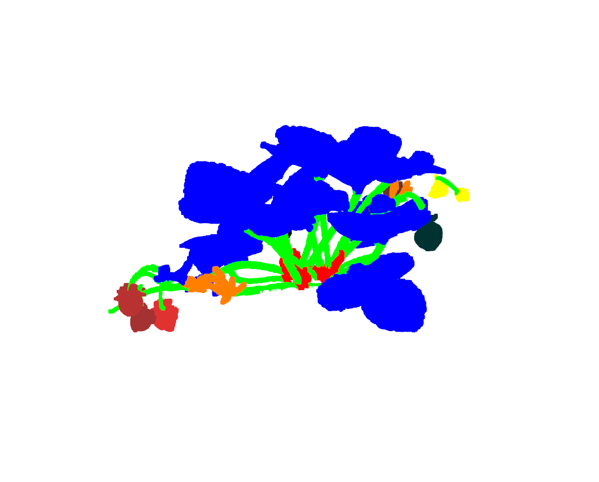
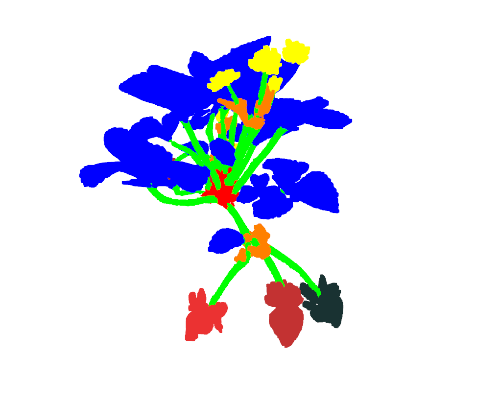
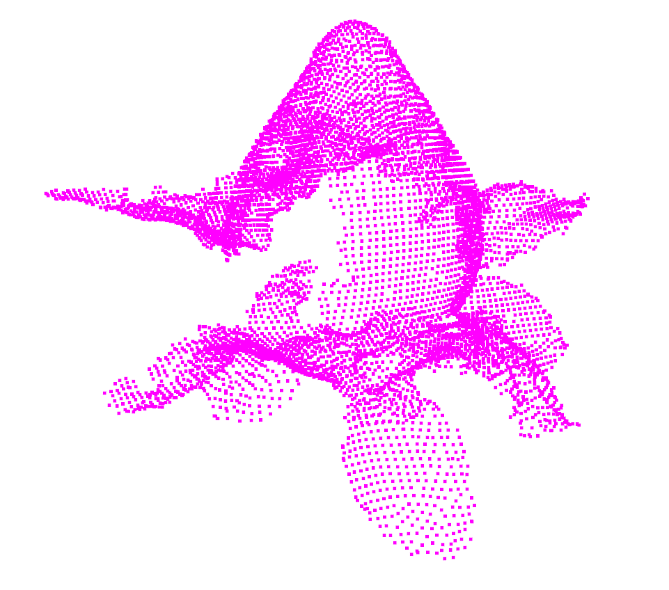

    

        
        
        
    

# LastSTRAW dataset test

Data and code that this test set is based upon can be found at [LAST-Straw](https://lcas.github.io/LAST-Straw/)

This repo contains a data importer class that can download, unzip and visualise the LAST-Straw data. The class is based upon Pytorch's Dataset class and can therefore be used within Pytorch's dataloader used for training models for machine learning.

The visualisation uses [Open3D](https://www.open3d.org/) 

## Filtering

As well as displaying raw data and segmented data, individual classes can be extracted

    

        
        
        
    

